
# Add-in IGN_Espace_collaboratif pour ArcGIS Pro

## Version 2.0.2
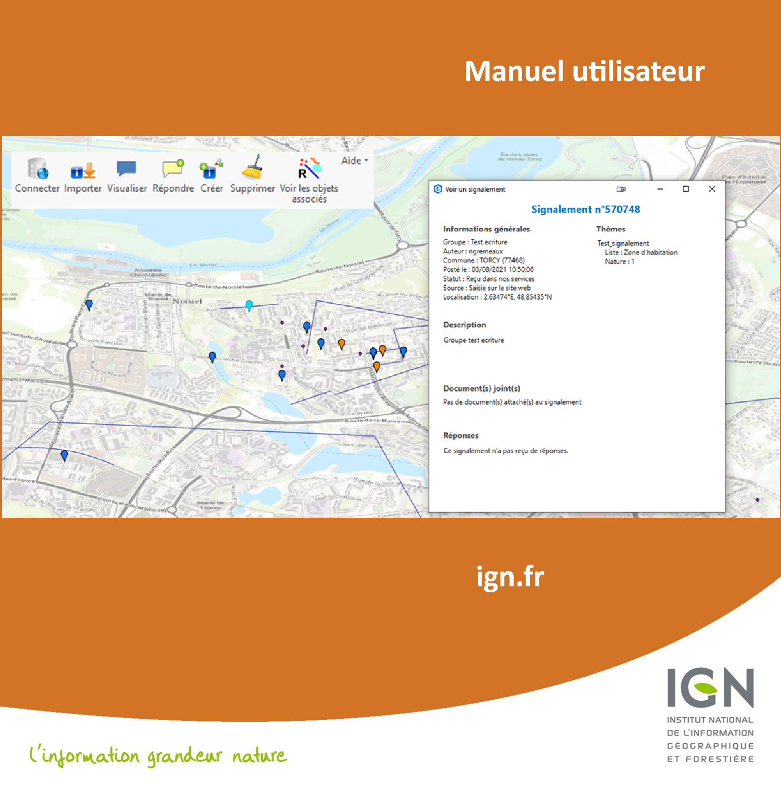 


<div  style="background-color: white; border: 1px solid black; padding: 10px; text-align: justify;">
  <h2 id="1-sommaire" style="color: #00ADC5">1. Sommaire</h2>
</div>

- [1. Sommaire](#1-sommaire)
- [2. Versions](#2-versions)
- [3. Préambule](#3-préambule)
  - [3.1 Présentation du service](#31-présentation-du-service)
  - [3.2 Rôle de l'add-in Espace collaboratif pour ArcGIS Pro](#32-rôle-de-ladd-in-espace-collaboratif-pour-arcgis-pro)
  - [3.3 Prérequis](#33-prérequis)
- [4. Installation et principes de fonctionnement](#4-installation-et-principes-de-fonctionnement)
  - [4.1 Procédure d'installation](#41-procédure-dinstallation)
  - [4.2 La barre d'outils IGN_Espace_collaboratif](#42-la-barre-doutils-ign_espace_collaboratif)
  - [4.3 Les couches gérées par l'add-in](#43-les-couches-gérées-par-ladd-in)
  - [4.4 Configuration de l'add-in](#44-configuration-de-ladd-in)
- [5. Utilisation](#5-utilisation)
  - [5.1 Connexion au service](#51-connexion-au-service)
    - [5.1.1 Cas d'un utilisateur appartenant à aucun groupe](#511-cas-dun-utilisateur-appartenant-à-aucun-groupe)
    - [5.1.2 Cas d'un utilisateur appartenant à au moins un groupe](#512-cas-dun-utilisateur-appartenant-à-au-moins-un-groupe)
  - [5.2 Import des signalements](#52-import-des-signalements)
  - [5.3 Visualisation d'un signalement](#53-visualisation-dun-signalement)
  - [5.4 Visualisation des attributs d'un croquis](#54-visualisation-des-attributs-dun-croquis)
  - [5.5 Répondre à un signalement](#55-répondre-à-un-signalement)
  - [5.6 Création d'un nouveau signalement](#56-création-dun-nouveau-signalement)
  - [5.7 Nettoyage de la carte](#57-nettoyage-de-la-carte)
  - [5.8 Visualiser les objets associés](#58-visualiser-les-objets-associés)
  - [5.9 Configurer l'add-in IGN_Espace_collaboratif](#59-configurer-ladd-in-ign_espace_collaboratif)
  - [5.10 Accéder au manuel utilisateur](#510-accéder-au-manuel-utilisateur)
  - [5.11 Afficher le fichier journal de l'add-in](#511-afficher-le-fichier-journal-de-ladd-in)
  - [5.12 Le menu À propos de l'add-in IGN_Espace_collaboratif](#512-le-menu-à-propos-de-ladd-in-ign_espace_collaboratif)
- [6. Annexes](#6-annexes)
  - [6.1 Tableau 1 : champs de la couche Signalement](#61-tableau-1--champs-de-la-couche-signalement)
  - [6.2 Tableau 2 : champs des couches Croquis_EC](#62-tableau-2--champs-des-couches-croquis_ec)
  - [6.3 Tableau 3 : Valeurs et signification des statuts d'un signalement](#63-tableau-3--valeurs-et-signification-des-statuts-dun-signalement)
  - [6.4 Formats acceptés pour les documents joints](#64-formats-acceptés-pour-les-documents-joints)
  - [6.5 Fichiers nécessaires au fonctionnement de l'add-in](#65-fichiers-nécessaires-au-fonctionnement-de-ladd-in)
  - [6.6 Exemple de contenu du fichier de configuration espaceco.xml](#66-exemple-de-contenu-du-fichier-de-configuration-espacecoxml)

---
<div  style="background-color: white; border: 1px solid black; padding: 10px; text-align: justify;">
  <h2 style="color: #00ADC5">2. Versions</h2>
</div>

| Numéro | Commentaire  | Date |
|--|--|--|
|2.0.0|Mise à jour des versions du document et d'ArcGIS Pro  |12/09/2024|
|2.0.1|Correction compatibilité addin|07/10/2025|
|2.0.2|Mise des données de l'espace co dans une GDB séparée|09/12/2025|
||Modification du filtrage pour la récupération des signalements.||


<div  style="background-color: white; border: 1px solid black; padding: 10px; text-align: justify;">
  <h2 id="3-préambule" style="color: #00ADC5">3. Préambule</h2>
</div>

### <span style="color: white; background-color: #00ADC5; padding: 2px 5px;">3.1 Présentation du service</span>

Le service de signalement de l’IGN (anciennement remontées d’information partagées RIPart) est un service offert par l’Institut national de l’information géographique et forestière (IGN) pour permettre à ses partenaires institutionnels de lui transmettre, de façon automatique et normalisée, des remarques concernant les données de l’Institut et qui nécessiteraient une correction ou une mise-à-jour. Ce service peut également être utilisé par les partenaires pour leurs propres besoins (mise à jour de données métiers, non destinées à l’IGN).

Le service est accessible sur l’Espace collaboratif de l’IGN : [https://espacecollaboratif.ign.fr](https://espacecollaboratif.ign.fr).

Chaque nouveau signalement sur une donnée IGN donne lieu à un traitement hiérarchisé au sein du service de l’IGN concerné par la remarque, qui y apportera des réponses officielles.

Un signalement contient :

-   **Une position géographique** pour situer le signalement ;
-   **Un commentaire** rédigé par l'auteur du signalement à l'adresse de l'IGN pour expliquer l’objet de son signalement ;
-   **Un statut** pour situer le signalement dans la chaîne de traitement (reçu dans nos services, en cours de traitement, pris en compte…) ;
-   Éventuellement **un thème** associé pour définir la thématique IGN et/ou la thématique métier concernées par le signalement. Il est à noter que les signalements sans thème auront le statut ‘en demande de qualification’ tant qu’ils n’auront pas un thème associé.
-   Éventuellement un ou plusieurs attributs liés au thème ;
-   Éventuellement des objets géométriques (ponctuels, linéaires, surfaciques) composant **un croquis** joint à ce signalement. Certains attributs de ce croquis peuvent aussi être joints au signalement ;
-   Éventuellement **de 1 à 4 fichiers joints** de formats divers (pdf, doc, images…).

Chaque signalement, sauf s’il est lié à un groupe ne partageant pas ses signalements, est accessible en consultation à tous les utilisateurs sur l’Espace collaboratif. Il y possède une fiche où tous ces éléments sont visibles ainsi que les réponses apportées par l’IGN.


### <span style="color: white; background-color: #00ADC5; padding: 2px 5px; text-align: justify;">3.2 Rôle de l'add-in Espace collaboratif pour ArcGIS Pro</span>
L'add-in IGN_Espace_collaboratif est une extension pour le logiciel ArcGIS Pro, qui permet depuis le SIG d'interagir directement avec le service Espace collaboratif (sans passer par le site web [espacecollaboratif.ign.fr](https://espacecollaboratif.ign.fr)).

L'utilisateur peut ainsi depuis ArcGIS Pro :
 - Importer, dans sa carte courante, l'ensemble des signalements d'un lieu donné ;
 - Consulter le contenu des signalements présents sur la carte ;
 - Leur ajouter une réponse (s’il en a la permission) ;
 - Créer de nouveaux signalements qui seront transmis au service concerné.
 
L'intégration de l'add-in dans le SIG se traduit visuellement par l’ajout d’une barre d'outils supplémentaire dédiée aux fonctionnalités de l'add-in, et par des couches ajoutées à la carte active et qui sont destinées à contenir les différents objets issus de l’Espace collaboratif (ses signalements et croquis associés).

### <span style="color: white; background-color: #00ADC5; padding: 2px 5px; width: 100%; box-sizing: border-box;">3.3 Prérequis</span>

L'add-in IGN_Espace_collaboratif pour ArcGIS Pro requiert la configuration minimum suivante :
-   Windows
-   Une connexion internet permanente (afin que l'add-in puisse communiquer avec le serveur de l’Espace collaboratif).
-   Le SIG ArcGIS Pro, **version 3.2.**

L'utilisation de l'add-in IGN_Espace_collaboratif nécessite de posséder un compte utilisateur sur le site [espacecollaboratif.ign.fr](https://espacecollaboratif.ign.fr). L’inscription à un groupe d’utilisateurs est ouverte ; l’affiliation à un groupe d’utilisateurs est en revanche soumise à acceptation par le ou les gestionnaires de ce groupe, et permet de déterminer le niveau de permission de l’utilisateur.

L'add-in IGN_Espace_collaboratif ne fonctionne qu'en association avec un projet ArcGIS Pro au format aprx. C'est à partir de cette carte que l'add-in va ajouter ses propres couches qui seront stockées parallèlement au fichier aprx dans la geodatabase associée au projet. C'est aussi dans ce même dossier que doit se situer le fichier de configuration de l'add-in **<span style="font-family: Consolas, monospace; color: #00B050">espaceco.xml</span>** (qui est créé automatiquement par l'add-in lors de la première utilisation).

NB : le nom du projet ArcGIS Pro dans lequel sera utilisé l'add-in Espace collaboratif ne doit pas contenir de point en dehors de son extension (.aprx).


<div  style="background-color: white; border: 1px solid black; padding: 10px; text-align: justify;">
  <h2  id="4-installation-et-principes-de-fonctionnement" style="color: #00ADC5">4. Installation et principes de fonctionnement</h2>
</div>

### <span style="color: white; background-color: #00ADC5; padding: 2px 5px; width: 100%; box-sizing: border-box;">4.1 Procédure d'installation</span>

-	Enregistrer le fichier ArcGisProEspaceCollaboratif.esriAddinX sur votre ordinateur.
-	Fermer toutes les applications ESRI éventuellement ouvertes.
-	Double cliquer sur le fichier ArcGisProEspaceCollaboratif.esriAddinX. La fenêtre suivante s’ouvre :

<div  style="text-align: center;"> 
	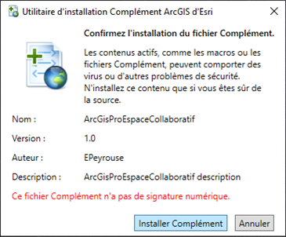 
</div>

-	Cliquer sur _Installer Complément._

### <span style="color: white; background-color: #00ADC5; padding: 2px 5px; width: 100%; box-sizing: border-box;">4.2 La barre d’outils IGN_Espace_collaboratif</span>

<div  style="text-align: center;"> 
	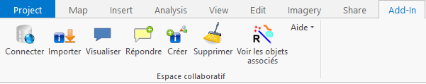 
	<p><strong><span style="color: #548DD4">Figure 1 : la barre d'outils de l’add-in IGN_Espace_collaboratif dans ArcGIS</span></strong></p>
</div>

La barre d’outils de l'add-in IGN_Espace_collaboratif est composée des outils suivants :

-   **1** Se connecter au service.
-   **2** Télécharger les signalements du service et les afficher sur la carte en cours.
-   **3** Visualiser le contenu d’un signalement (commentaire, réponses, document joint, croquis associés).
-   **4** Ajouter une nouvelle réponse à un signalement, qui sera envoyée à l’Espace collaboratif.
-   **5** Rédiger un nouveau signalement et l’envoyer à l’Espace collaboratif.
-   **6** Effacer, dans la carte courante, tous les objets signalements et croquis présents.
-   **7** Sélectionner les croquis associés à un ou plusieurs signalements, ou les signalements associés à un ou plusieurs croquis.
-   **8** Dérouler le menu d’aide de l'add-in.

### <span style="color: white; background-color: #00ADC5; padding: 2px 5px; width: 100%; box-sizing: border-box;">4.3 Les couches gérées par l'add-in</span>

Lors du premier chargement des signalements, l'add-in ajoute dans la carte 6 couches destinées à contenir les différents objets IGN_Espace_collaboratif. **Ces couches et leurs objets sont enregistrés dans une géodatabase séparée (Nouveauté version 2.0.2).**

<div  style="text-align: center;"> 
	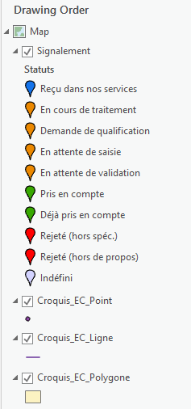
  <p><strong><span style="color: #548DD4">Figure 2 : Couches ajoutées par l’add-in dans le projet ArcGIS Pro</span></strong></p>
</div>

Ces couches dédiées se nomment :
-   **<span style="color: #00B050">Signalement</span>** : contient les signalements de l’Espace collaboratif sous forme de ponctuels. Les champs de cette couche stockent les différents attributs associés aux signalements.
-   **<span style="color: #00B050">Croquis_EC_Point</span>** : contient les croquis de type ponctuel.
-   **<span style="color: #00B050">Croquis_EC_Ligne</span>** : contient les croquis de type linéaire sous forme de polylignes.
-   **<span style="color: #00B050">Croquis_EC_Polygone</span>** : contient les croquis de type surfacique sous forme de polygones simples. 

Ces 4 couches utilisent le même système géographique de coordonnées que celui utilisé par le service Espace collaboratif (WGS84, coordonnées géographiques en degrés décimaux). Néanmoins, l'utilisateur peut utiliser n’importe quel système géographique de coordonnées qui lui convient. L'add-in IGN_Espace_collaboratif et le SIG ArcGIS Pro assurent de façon automatique et transparente le changement de projection à la volée et dans les deux sens.

L'add-in propose une symbologie par défaut pour les signalements en fonction de la valeur du champ statut[^1]. Néanmoins, l’utilisateur peut utiliser toute autre symbologie à sa convenance.

[^1]: Cf. Tableau 3 : Valeurs et signification des statuts


### <span style="color: white; background-color: #00ADC5; padding: 2px 5px; width: 100%; box-sizing: border-box;">4.4 Configuration de l'add-in</span>

Pour son fonctionnement, l'add-in stocke tous ses paramètres de configuration dans un fichier de type XML dénommé **<span style="font-family: Consolas, monospace; color: #00B050">espaceco.xml</span>**. Ce dernier se situe dans le même dossier que celui qui contient le fichier projet ArcGIS Pro (.aprx).

Ce fichier étant nécessaire à son fonctionnement, l'add-in le génère automatiquement s’il n’existe pas déjà. Le paramétrage de l'add-in se fait via la fenêtre de configuration qui s’ouvre depuis le menu **<span style="font-family: Consolas, monospace; color: #0000FF">[Aide > Configurer le plugin]</span>**  de la barre d'outils. Les nouveaux paramètres saisis sont ensuite automatiquement enregistrés dans ce fichier XML.

<div  style="background-color: white; border: 1px solid black; padding: 10px; text-align: justify;">
  <h2 id="5-utilisation" style="color: #00ADC5">5. Utilisation</h2>
</div>

### <span style="color: white; background-color: #00ADC5; padding: 2px 5px; width: 100%; box-sizing: border-box;">5.1 Connexion au service</span>

<div  style="text-align: center;"> 
	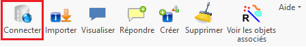
</div>

Toute interaction entre ArcGIS Pro et le service Espace collaboratif nécessite une authentification auprès de ce dernier avec un compte utilisateur existant.

L’action de connexion au service est lancée automatiquement par l'add-in avant chaque action en cas d'absence de connexion. Elle peut aussi être manuellement lancée par l'utilisateur en cliquant sur le bouton **<span style="font-family: Consolas, monospace; color: #0000FF">Se connecter au service Espace collaboratif</span>**. Dans tous les cas, cela provoque l'ouverture d’une page web d’authentification.

Le champ **<span style="font-family: Consolas, monospace; color: #0000FF">Votre login</span>** est pré-rempli par le login utilisé lors de la dernière connexion.

<div  style="text-align: center;"> 
	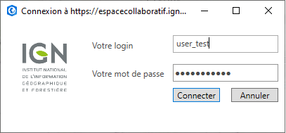
  <p><strong><span style="color: #548DD4">Figure 3 : Formulaire de connexion au service Espace collaboratif</span></strong></p>
</div>

La fermeture d'ArcGIS Pro interrompt la connexion au service. Il faut donc la rétablir lors de l’utilisation suivante du SIG.

**Note :** En cas d’échec de la connexion (message : « la connexion a échoué »), il peut s’agir d’un problème d’accès au serveur. La définition des variables d’environnement HTTP_PROXY et HTTPS_PROXY avec les valeurs ad-hoc (dépendant de votre établissement) peut régler le problème.

#### <span style="color: #00ADC5">5.1.1 Cas d'un utilisateur appartenant à aucun groupe</span>

Au clic sur le bouton « Connecter », une fenêtre de confirmation apparaît :

<div  style="text-align: center;"> 
	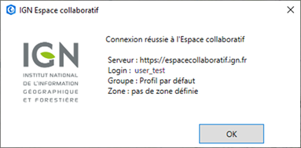
  <p><strong><span style="color: #548DD4">Figure 4  : Fenêtre de confirmation de connexion pour un utilisateur sans groupe</span></strong></p>
</div>

#### <span style="color: #00ADC5">5.1.2 Cas d’un utilisateur appartenant à au moins un groupe</span>

**->** Au clic sur le bouton « Connecter », une nouvelle fenêtre permettant de paramétrer l’utilisation de l'add-in apparaît :

<div  style="text-align: center;"> 
	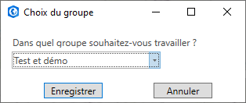
  <p><strong><span style="color: #548DD4">Figure 5 : Fenêtre de paramétrage du groupe</span></strong></p>
</div>

Si l’utilisateur appartient à plusieurs groupes, un menu déroulant lui permet de choisir celui dans lequel il souhaite travailler. S’il n’appartient qu’à un seul groupe, celui-ci est sélectionné par défaut.


**->** Après avoir cliqué sur le bouton « Enregistrer », une fenêtre de confirmation de connexion, reprenant le paramétrage choisi par l’utilisateur, est affichée :

<div  style="text-align: center;"> 
	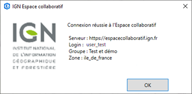
  <p><strong><span style="color: #548DD4">Figure 6 : Fenêtre de confirmation de connexion pour un utilisateur avec groupe</span></strong></p>
</div>


### <span style="color: white; background-color: #00ADC5; padding: 2px 5px; width: 100%;">5.2 Import des signalements</span>

<div  style="text-align: center;"> 
	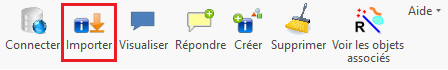
</div>

Cliquer sur le bouton **<span style="font-family: Consolas, monospace; color: #0000FF">Importer</span>** pour lancer la procédure de téléchargement des signalements depuis l’espace collaboratif IGN.

La procédure efface préalablement tous les objets des calques spécifiques au fonctionnement de l'add-in IGN_Espace_collaboratif présents sur la carte. Les signalements importés sont mis dans la couche **<span style="font-family: Consolas, monospace; color: #00B050">Signalement</span>**. Lorsqu’ils sont accompagnés de croquis, ces derniers sont importés dans les différents calques **<span style="font-family: Consolas, monospace; color: #00B050">Croquis_EC</span>**.

L'add-in propose dans le formulaire de configuration, deux options pour filtrer[^2] l'import des signalements selon les besoins de l'utilisateur :

[^2]: Il existe également un filtrage thématique paramétrable sur l’Espace collaboratif pour importer des signalements sur des thèmes précis.

-   Le **filtrage spatial** : on choisit la couche contenant l’emprise à utiliser pour filtrer les signalements à importer.

**NB : le comportement du filtrage spatial a changé en version 2.0.2 :**

Cas 1 : le nom de l'emprise dans le fichier de configuration et la sélection sont vides -> extraction France entière

Cas 2 : le nom de l'emprise est indiqué dans le fichier de configuration mais la couche n'existe pas dans la carte et la sélection est vide -> extraction France entière

Cas 3 : la couche "emprise" existe mais ne contient pas d'objets et la sélection est vide -> extraction France entière

Cas 4 : la sélection est vide mais la couche "emprise" pour le filtrage spatial contient un ou plusieurs objets -> extraction à partir des polygones de cette couche

Cas 5 : la sélection est remplie et la couche pour le filtrage spatial contient un ou plusieurs objets -> extraction à partir de la sélection

Cas par défaut : extraction France entière

-   Le **filtrage chronologique** : l’utilisateur précise une date et seuls les signalements mis à jour depuis cette date seront importés.

L'import de tous les signalements depuis le service Espace collaboratif peut prendre un certain temps en fonction du  nombre de signalements et de la qualité de la connexion réseau. C'est pourquoi il est judicieux d'utiliser les options de filtrage pour limiter le nombre de signalements à télécharger.

À l'issue du téléchargement, une fenêtre annonce le succès de l'opération et détaille la répartition des signalements importés selon leur statut.


<div  style="text-align: center;"> 
	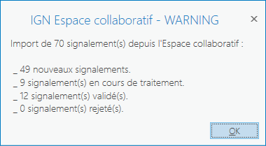
  <p><strong><span style="color: #548DD4">Figure 7 : Fenêtre annonçant la réussite du téléchargement des signalements depuis l’Espace collaboratif</span></strong></p>
</div>

### <span style="color: white; background-color: #00ADC5; padding: 2px 5px; width: 100%;">5.3 Visualisation d'un signalement</span>

<div  style="text-align: center;"> 
	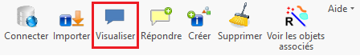
</div>

Sélectionner un signalement sur la carte à l’aide du bouton de sélection d’ArcGIS, puis cliquer sur le bouton **<span style="color: #0000FF">Visualiser</span>**.

Une fenêtre avec les informations du signalement (description, thème et attributs, commentaire, réponses éventuelles) s’ouvre :

<div  style="text-align: center;"> 
	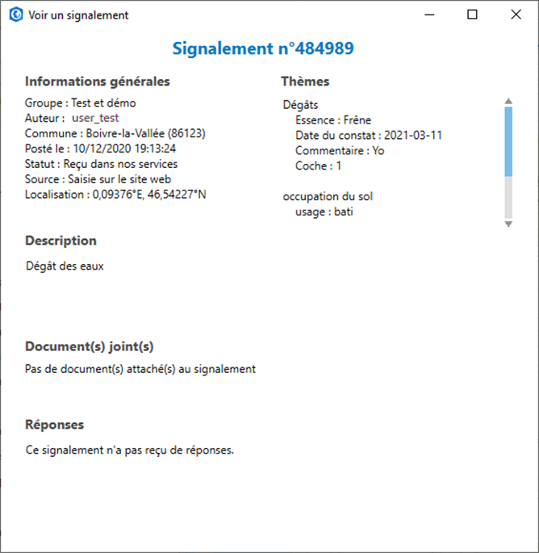
  <p><strong><span style="color: #548DD4">Figure 8 : Fiche d’un signalement</span></strong></p>
</div>

Cette fenêtre permet également d’ouvrir les documents joints s’il y en a.

### <span style="color: white; background-color: #00ADC5; padding: 2px 5px; width: 100%;">5.4 Visualisation des attributs d'un croquis</span>

Lorsqu’un croquis joint à un signalement a des attributs, ceux-ci peuvent être consultés via la fonction « Explorer » d’ArcGIS ou en ouvrant la table Croquis_EC_xxx correspondant au type du croquis.

<div  style="text-align: center;"> 
	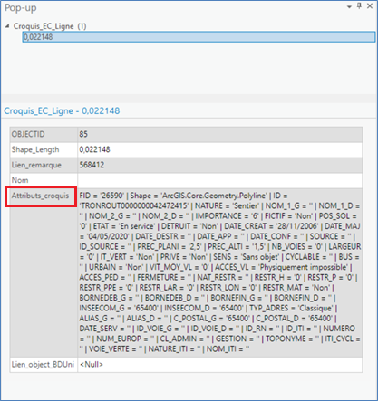
  <p><strong><span style="color: #548DD4">Figure 9 : Exemple d’attributs liés à un croquis</span></strong></p>
</div>

### <span style="color: white; background-color: #00ADC5; padding: 2px 5px; width: 100%;">5.5 Répondre à un signalement</span>

<div  style="text-align: center;"> 
	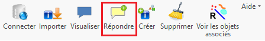
</div>

Pour ajouter une réponse : sélectionner un signalement sur la carte, puis cliquer sur le bouton **<span style="font-family: Consolas, monospace; color: #0000FF">Répondre</span>**.

Le formulaire d'ajout d'une réponse est composé comme suit :
-	Un champ facultatif « Ma réponse » pour rédiger la nouvelle réponse au signalement.
-	Un menu déroulant « Nouveau statut » pour indiquer le statut à appliquer au signalement.

<div  style="text-align: center;"> 
	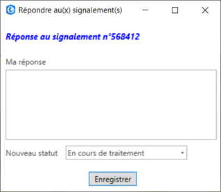
  <p><strong><span style="color: #548DD4">Figure 10  : Formulaire de réponse à un signalement</span></strong></p>
</div>

### <span style="color: white; background-color: #00ADC5; padding: 2px 5px; width: 100%;">5.6 Création d'un nouveau signalement</span>

<u>Note</u> : avant la création d‘un signalement, il est indispensable d’avoir préalablement chargé une première fois les signalements (cf. 5.2).

<div  style="text-align: center;"> 
	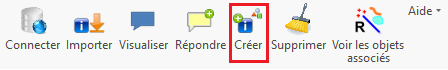
</div>

Sélectionner un ou plusieurs objets sur la carte, puis cliquer sur le bouton **<span style="font-family: Consolas, monospace; color: #0000FF">Créer</span>**. 

Les objets sélectionnés seront transformés en croquis pour l’Espace collaboratif et joints au nouveau signalement si l'option idoine est activée. C’est aussi à partir de ces objets sélectionnés que l'add-in détermine la position géographique du signalement à créer (situé au centroïde des objets sélectionnés).

Le formulaire suivant permet de :

- choisir dans quel groupe (parmi les groupes de l’utilisateur) est créé le signalement ;
- rédiger un commentaire ;
- sélectionner le/les thèmes concernés par le signalement ;
- remplir les éventuels attributs du ou des thèmes sélectionnés ;
- joindre un croquis (l’option « joindre un croquis » est cochée par défaut, et détermine s'il faut joindre au nouveau signalement le (ou les) croquis généré(s) à partir des objets sélectionnés)
- joindre un document : la taille du fichier ne doit pas excéder 5 Mo, les formats autorisés sont listés dans l’annexe 5.3 ;
- créer un ou plusieurs signalement(s) : dans le premier cas, un signalement unique est créé et positionné sur le centroïde de l’ensemble des objets sélectionnés. Dans le second cas, il est créé un nouveau signalement par objet sélectionné, avec pour position, à chaque fois, le centroïde de l’objet.

<div  style="text-align: center;">
	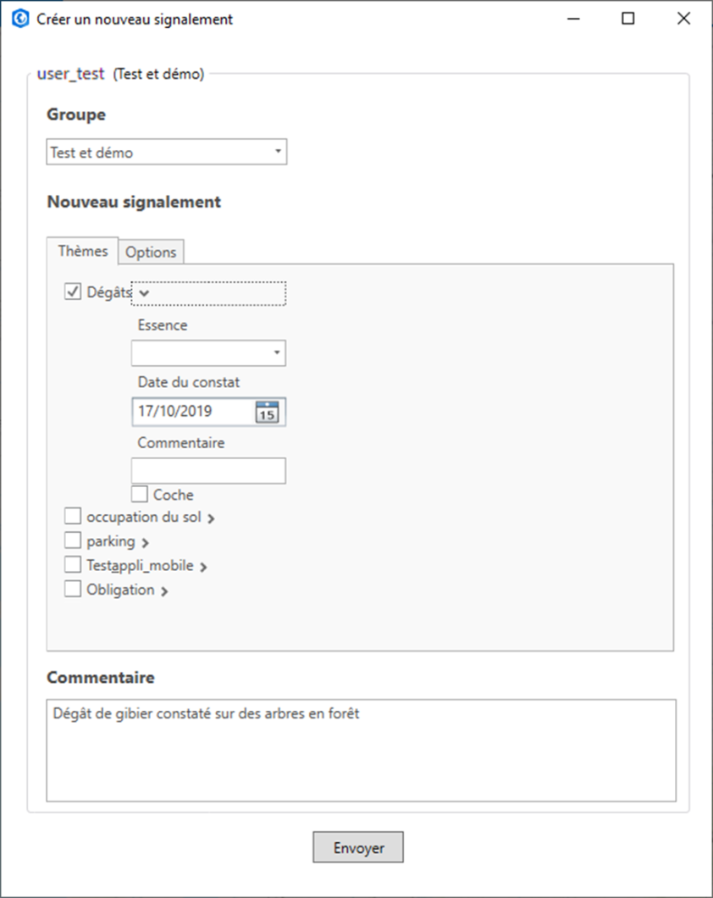       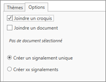
  <p><strong><span style="color: #548DD4">Figure 11 : Formulaires de création de nouveaux signalements</span></strong></p>
</div>

Un message informe du succès de l'envoi vers l’Espace collaboratif du nouveau signalement, puis celui-ci est affiché sur la carte.


### <span style="color: white; background-color: #00ADC5; padding: 2px 5px; width: 100%;">5.7 Nettoyage de la carte</span>

<div  style="text-align: center;"> 
	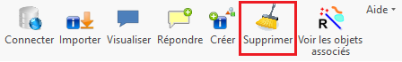
</div>

Cliquer sur le bouton **<span style="font-family: Consolas, monospace; color: #0000FF">Supprimer</span>**  provoque la suppression sur la carte en cours de tous les objets IGN_Espace_collaboratif (signalements et croquis) qu'elle contenait. Ceux-ci ne sont en revanche pas supprimés sur l’Espace collaboratif.
Les autres données présentes dans la carte ne sont pas affectées par l'opération.


### <span style="color: white; background-color: #00ADC5; padding: 2px 5px; width: 100%;">5.8 Visualiser les objets associés</span>

<div  style="text-align: center;"> 
	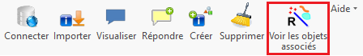
</div>

Cet outil (baguette magique) permet de sélectionner sur la carte tous les croquis associés à un ou plusieurs signalements, ou inversement, tous les signalements associés à un ou plusieurs croquis.

**Exemple :**

On sélectionne deux signalements (en jaune), puis on clique sur le bouton **<span style="font-family: Consolas, monospace; color: #0000FF">Voir les objets associés</span>**. Tous les croquis associés aux deux signalements sont alors sélectionnés

<div  style="text-align: center;">
	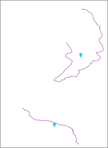        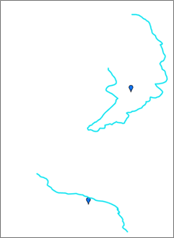
  <p><strong><span style="color: #548DD4">Figure 12  : Exemple d’utilisation de la « Baguette magique »</span></strong></p>
</div>

Si on clique à nouveau sur le bouton, on retrouve la première situation avec les deux signalements sélectionnés.


### <span style="color: white; background-color: #00ADC5; padding: 2px 5px; width: 100%;">5.9 Configurer l'add-in IGN_Espace_collaboratif</span>

<div  style="text-align: center;"> 
	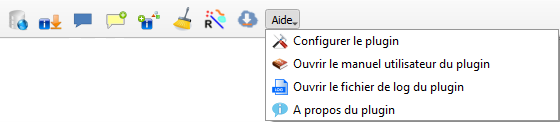
</div>

Cliquer sur **<span style="font-family: Consolas, monospace; color: #0000FF">Configurer</span>**  dans le menu Aide permet d’ouvrir le formulaire d'édition des paramètres de fonctionnement de l'add-in. Tous ces paramètres sont stockés dans le fichier de configuration espaceco.xml.

Dans ce formulaire peuvent être édités les paramètres suivants :

-   **Adresse de connexion au service Espace collaboratif** : l’url du service : https://espacecollaboratif.ign.fr (il est recommandé de la modifier uniquement en cas d’instruction de la part de l’IGN).

-   **Login par défaut** : le login à utiliser par défaut lors de la tentative d'authentification vers le service Espace collaboratif. Par défaut (case non cochée) aucun login.

- **Date d’extraction** : date utilisée pour le filtrage temporel lors du téléchargement des signalements. Seuls les signalements mis à jour depuis cette date seront téléchargés. Par défaut (case non cochée), pas de filtre selon la date.

-   **Couche pour filtrage spatial** : choix de la couche à utiliser pour le filtrage spatial lors du téléchargement des signalements. Seuls les signalements intersectant des objets de la couche seront téléchargés. Par défaut (case non cochée), pas de filtre spatial.

-	**Proxy** : permet à l’utilisateur de rentrer ses paramètres de proxy (s’il en a un) directement depuis cette interface.

Les paramètres suivants ne sont pas modifiables directement et sont remplis en fonction des choix faits par l’utilisateur lors de sa dernière connexion. Ils seront mis à jour automatiquement lors de la connexion suivante :

- **Groupe actif** : groupe à proposer par défaut à l’utilisateur lors de sa connexion au service.

- **Clé Géoportail** : clé Géoportail à proposer par défaut à l’utilisateur lors de sa connexion au service.


<div  style="text-align: center;"> 
	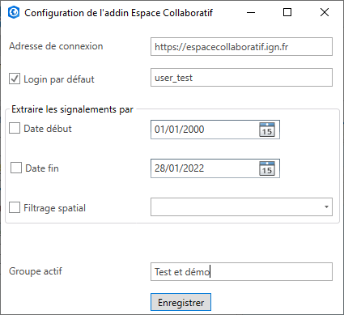
  <p><strong><span style="color: #548DD4">Figure 13: Formulaire de configuration de l’add-in</span></strong></p>
</div>

### <span style="color: white; background-color: #00ADC5; padding: 2px 5px; width: 100%;">5.10 Accéder au manuel utilisateur</span>

<div  style="text-align: center;"> 
	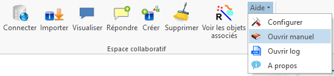
</div>

Ouvre la dernière version du manuel utilisateur (au format .pdf) hébergé sur le site web consacré à l’add-in IGN_Espace_collaboratif pour ArcGIS Pro.

### <span style="color: white; background-color: #00ADC5; padding: 2px 5px; width: 100%;">5.11 Afficher le fichier journal de l'add-in</span>

<div  style="text-align: center;"> 
	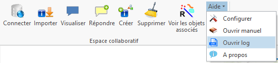
</div>

L’add-in IGN_Espace_collaboratif enregistre le déroulé des événements dans un fichier journal. Pour le consulter, il suffit de cliquer sur **<span style="font-family: Consolas, monospace; color: #0000FF">Ouvrir log</span>** du menu **<span style="font-family: Consolas, monospace; color: #0000FF">Aide</span>**.

En cas de dysfonctionnent, il peut être utile de consulter ce log pour connaître la description complète de l’erreur qui est à l’origine du problème. Dans le cadre de sa démarche d’assistance pour les logiciels qu’il distribue, l’IGN pourrait être amené à demander qu’on lui envoie ce log pour analyser la cause du dysfonctionnement (et, si besoin est, apporter une correction dans la prochaine version de l’add-in).

### <span style="color: white; background-color: #00ADC5; padding: 2px 5px; width: 100%;">5.12 Le menu À propos de l'add-in IGN_Espace_collaboratif</span>

Les informations de version de l’add-in sont consultables dans le menu **<span style="font-family: Consolas, monospace; color: #0000FF">Aide > A propos</span>**. 


<div  style="background-color: white; border: 1px solid black; padding: 10px; text-align: justify;">
  <h2 id="6-annexes" style="color: #00ADC5">6. Annexes</h2>
</div>


### <span style="color: white; background-color: #00ADC5; padding: 2px 5px; width: 100%;">6.1 Tableau 1 : champs de la couche Signalement</span>

| Nom | Type  | Contenu |
|--|--|--|
| NoSignalement|int|L'identifiant unique d'un signalement|
|Auteur|Text|Le login du compte Espace collaboratif utilisé par le rédacteur du signalement.|
|Commune|Text|Le nom de la commune dans laquelle se trouve le signalement|
|Insee|Text|Code Insee de la commune|
|Département|Text|Le nom du département dans lequel se trouve le signalement|
|Département_ID|Text|Le code du département dans lequel se trouve le signalement|
|Date_de_création|Date & heure|La date et l'heure de saisie du signalement (création dans le service).|
|Date_MAJ|Date & heure|La date et l'heure de la dernière action apportée au signalement. (ajout d'une réponse, changement de statut et clôture du signalement.)|
|Date_validation|Date & heure|La date et l'heure de l'action de clôture du signalement (prise en compte ou rejet)|
|Thèmes|Text|La concaténation du nom des thèmes associés au signalement ainsi que des éventuels attributs.|
|Statut|int|Le stade d'avancement dans la chaîne de traitement du signalement|
|Message|Text|Le commentaire envoyé lors de la création du signalement|
|Réponses|Text|La concaténation des réponses apportées à le signalement|
|URL|Text|Lien vers la fiche publique du signalement sur l’espace collaboratif|
|Document|Text|Lien vers le fichier associé au signalement et téléchargeable depuis l’espace collaboratif.|
|Autorisation|Text|Droits de réponse et de fermeture (attribution d’un statut clôturant) des signalements|
|Source|Text|Application utilisée pour la création du signalement (site web, application mobile, plugin SIG, UNKNOWN = API)|


### <span style="color: white; background-color: #00ADC5; padding: 2px 5px; width: 100%;">6.2 Tableau 2 : champs des couches Croquis_EC</span>

| Nom du champ | Type de champ | Contenu du champ |
|--|--|--|
|Lien_Signalement|int|Le numéro signalement à laquelle le croquis est associé.|
|Nom|string|Le nom du croquis.|
|Attributs_croquis|string|Concaténation des éventuels attributs du croquis sous forme : nom attribut = "valeur attribut".|

### <span style="color: white; background-color: #00ADC5; padding: 2px 5px; width: 100%;">6.3 Tableau 3 : Valeurs et signification des statuts d'un signalement</span>

<div  style="text-align: left;"> 
	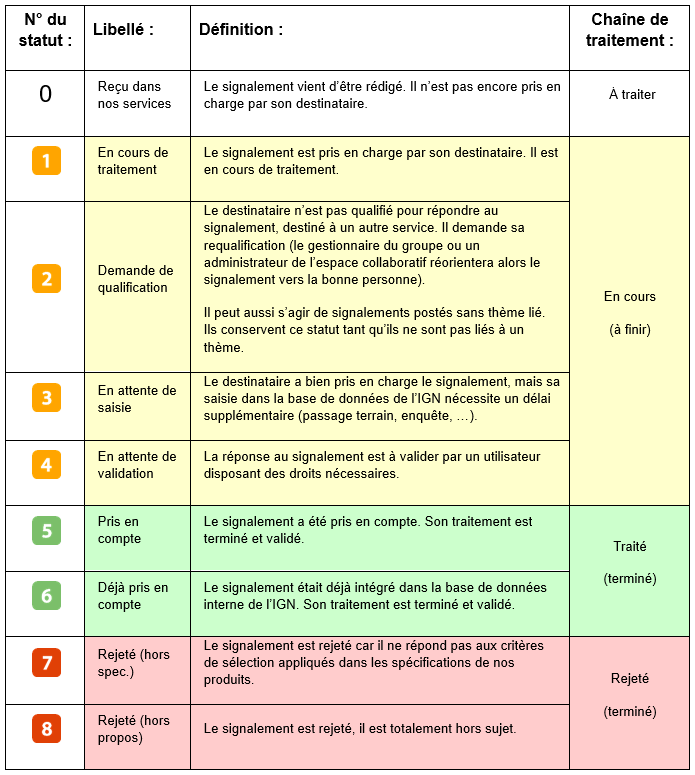
</div>

### <span style="color: white; background-color: #00ADC5; padding: 2px 5px; width: 100%;">6.4 Formats acceptés pour les documents joints</span>

|Fichiers images |bmp, gif, jpg, jpeg, png  |
|Fichiers GPS |gpx |
|Fichiers textes|doc, docx, odt, pdf, txt |
|Feuilles de calcul|csv, kml, ods, xls, xlsx|
|Fichiers compressés|zip, 7z |

### <span style="color: white; background-color: #00ADC5; padding: 2px 5px; width: 100%;">6.5 Fichiers nécessaires au fonctionnement de l'add-in</span>

<div  style="text-align: center;"> 
	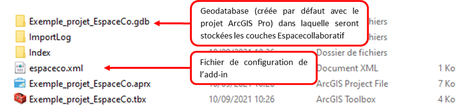
</div>


### <span style="color: white; background-color: #00ADC5; padding: 2px 5px; width: 100%;">6.6 Exemple de contenu du fichier de configuration espaceco.xml</span>

```xml
<Parametres_connexion_a_EspaceCollaboratif>
  <Serveur>
    <URLHost>https://espacecollaboratif.ign.fr</URLHost>
    <cle_geoportail>Démonstration</cle_geoportail>
    <groupe_actif>Test et démo</groupe_actif>
    <groupe_prefere>Test et démo</groupe_prefere>
    <Login>user_test</Login>
    <Proxy>
    </Proxy>
  </Serveur>
  <Map>
    <Pagination>100</Pagination>
    <Afficher_Croquis>Oui</Afficher_Croquis>
    <Zone_extraction>ile_de_france</Zone_extraction>
    <Date_extraction>01/01/2000 00:00:00</Date_extraction>
    <Import_pour_groupe>false</Import_pour_groupe>
    <Themes_preferes>
      <Theme>Dégâts</Theme>
    </Themes_preferes>
  </Map>
</Parametres_connexion_a_EspaceCollaboratif>
```
